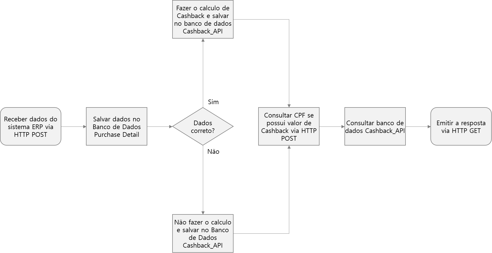
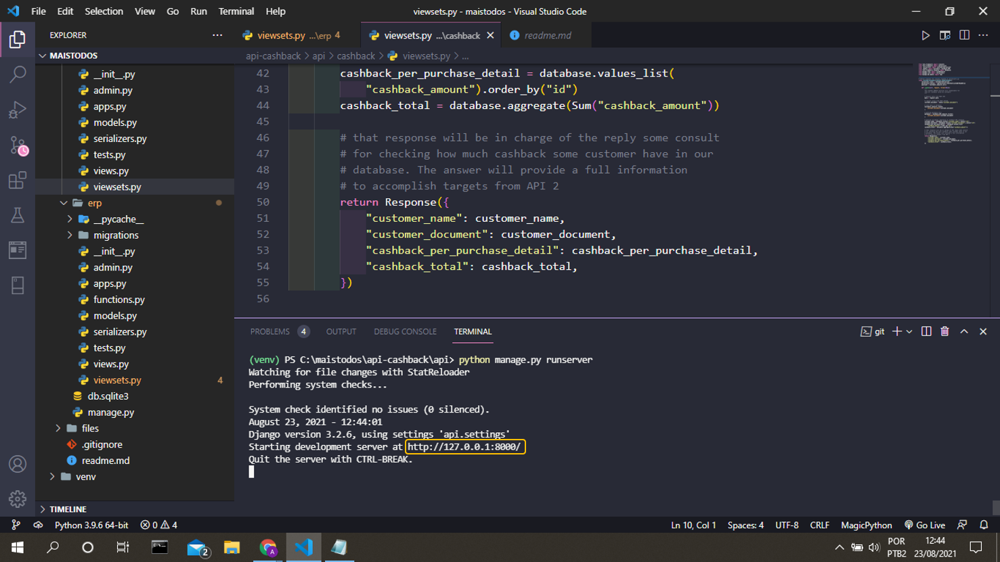
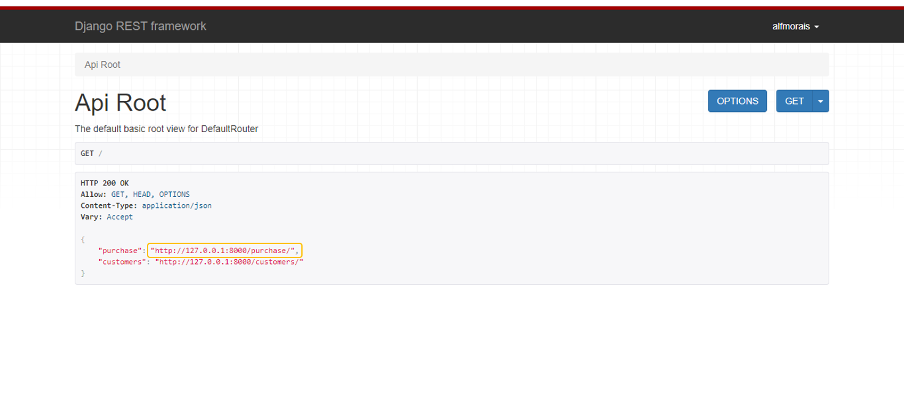
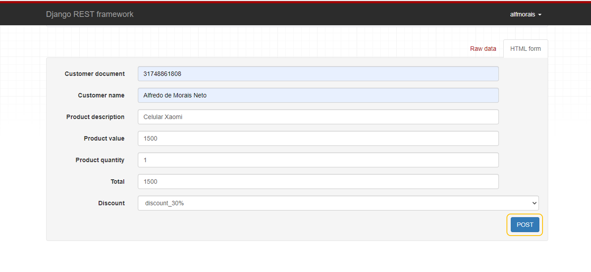
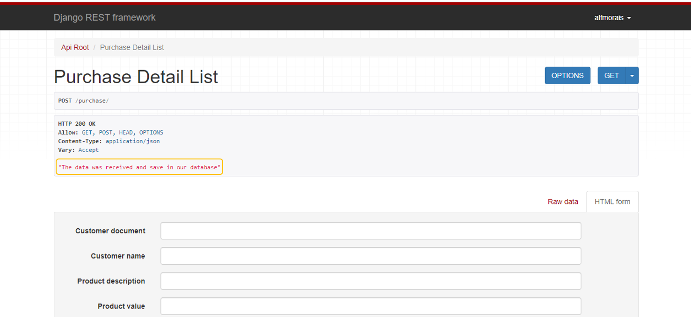
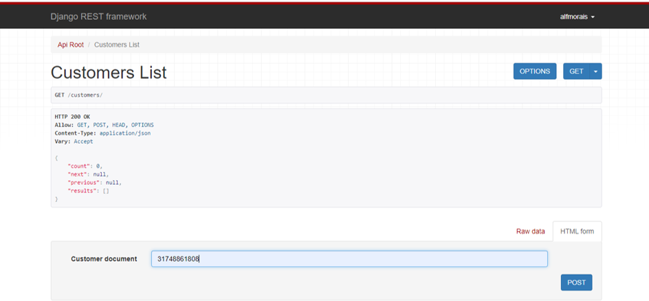
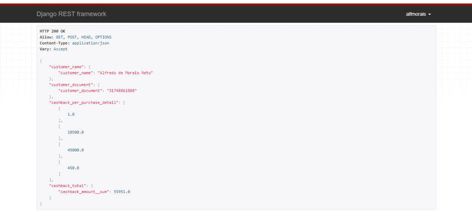
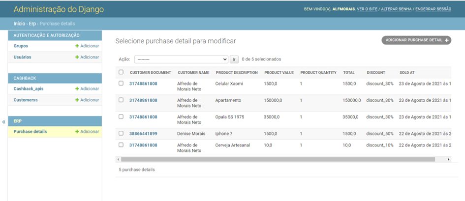
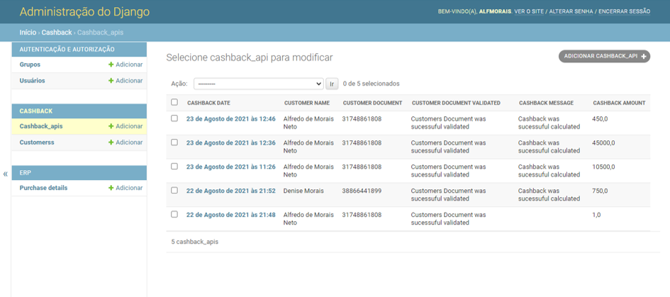
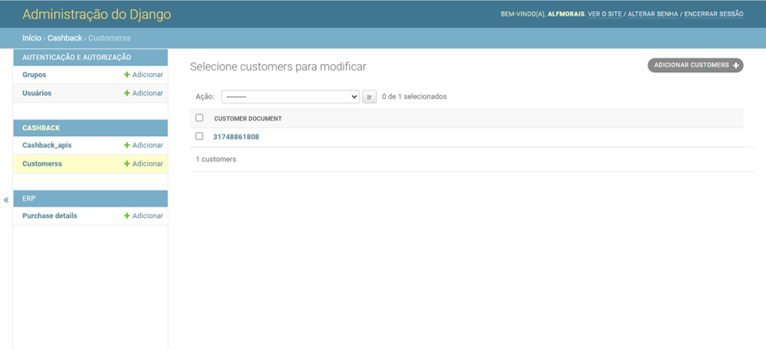

# Projeto API Cashback

## Introdução

O projeto de desenvolvimento da API (Application Programming Interface) tem como objetivo, receber dados de um sistema ERP varejista e calcular o valor de cashback para o cliente de acordo com a regra de negócio. Para mais detalhes do projeto, consulte a [proposta técnica](files/readme.md).

## Stacks Utilizadas:

Frameworks utilizado no desenvolvimento do projeto:

Retirado do arquivo requirements.txt

~~~txt
asgiref==3.4.1
certifi==2021.5.30
charset-normalizer==2.0.4
Django==3.2.6
django-filter==2.4.0
djangorestframework==3.12.4
idna==3.2
Markdown==3.3.4
pytz==2021.1
requests==2.26.0
sqlparse==0.4.1
urllib3==1.26.6
~~~

## Preparação do Ambiente: 

O módulo <b>venv</b> fornece soluções para criar ambientes virtuais isolado do diretória do sistema. A principal vantagem é isolar o <b>venv</b> do Sistema Operacional, para evitar conflitos de pacotes e bibliotecas.

### Criar um Ambiente Virtual

Os seguintes passos descreve como criar um ambiente virtual no sistema operacional Windowns. Para informações de MacOS e Unix, porfavor consulte a documentação para [Criação de Ambientes Virtuais](https://docs.python.org/pt-br/3/library/venv.html).

~~~cmd
mkdir API-CASHBACK

cd API-CASHBACK

python -m venv api-cashback
~~~

### Ativando o Ambiente Virtual

~~~cmd
api-cashback/Scripts/Activate
~~~

Deve aparecer a palavra (api-cashback) na cor verde, indicando que o ambiente virtual está ativado.

## Instalação dos Pacotes e Bibliotecas:

## Iniciando o projeto:

1. Iniciando o projeto Django. 

~~~cmd
django-admin startproject api
~~~

2. Iniciando as aplicações.

~~~cmd
django-admin startapp cashback
django-admin startapp erp
~~~

## Configurando o projeto:

Configurando o arquivo settings.py: 

~~~python
INSTALLED_APPS = [
    'django.contrib.admin',
    'django.contrib.auth',
    'django.contrib.contenttypes',
    'django.contrib.sessions',
    'django.contrib.messages',
    'django.contrib.staticfiles',
    # projects define by developer
    'rest_framework.authtoken',
    'rest_framework',
    'api',
    'erp',
    'cashback',
]
~~~

~~~python
LANGUAGE_CODE = 'pt-br'

TIME_ZONE = 'America/Sao_Paulo'
~~~

Fazendo todas as migrações iniciais do banco de dados:

~~~cmd
python manage.py makemigrations
python manage.py migrate
~~~

## Definindo o banco de dados no models.py

Definindo o banco de dados no arquivo models.py da primeira API ERP.

~~~python
from django.db import models

# Create your models here.
# Models applied in ERP API
class PurchaseDetail(models.Model):
    """
    This class are applied Purchase Detail
    """
    DISCOUNT_CHOICES = [
        ('A', 'discount_10%'),
        ('B', 'discount_30%'),
        ('C', 'discount_50%'),
    ]
    sold_at = models.DateTimeField(auto_now=True)
    customer_document = models.CharField(max_length=11)
    customer_name = models.CharField(max_length=50)
    product_description = models.CharField(max_length=100, default='')
    product_value = models.FloatField()
    product_quantity = models.PositiveIntegerField()
    total = models.FloatField()
    discount = models.CharField(choices=DISCOUNT_CHOICES,
                                max_length=255)
~~~ 

Definindo o banco de dados no arquivo models.py da segunda API Cashback

~~~python
from django.db import models

# Create your models here.
class Cashback_API(models.Model):
    """
    This is model to renderize the Cashback_API
    """
    cashback_date = models.DateTimeField(auto_now_add=True)
    customer_name = models.CharField(max_length=50)
    customer_document = models.CharField(max_length=11)
    customer_document_validated = models.CharField(
        max_length=255)
    cashback_message = models.CharField(max_length=255)
    cashback_amount = models.FloatField()

class Customers(models.Model):
    """
    This is model to check customers document (CPF)
    """
    customer_document = models.CharField(max_length=11)
~~~

## Definindo o serialiazers.py

Definição de Serializer: 
[Serialização é o processo de transformar dados em um formato que pode ser armazenado ou transmitido e, então, reconstruído. Ele é usado em todas as partes do desenvolvimento de aplicações, ou quando estamos armazenando dados numa base de dados, na memória ou convertendo-os em arquivos.](https://labcodes.com.br/blog/pt-br/development/como-usar-serializers-de-django-rest-framework/)

Codificando o serializer da aplicação API ERP.

~~~python
# all packages necessary to work serializers
from rest_framework import serializers
from .models import PurchaseDetail

# Define serializers class from PurchaseDetail and Products
class PurchaseDetailSerializer(serializers.ModelSerializer):

    class Meta:
        model = PurchaseDetail
        fields = '__all__'
~~~

Codificando o serializer da aplicação API Cashback

~~~python
# all packages necessary to work serializers
from rest_framework import serializers
from .models import Customers, Cashback_API

# Define serializers class from Customers
class CustomersSerializer(serializers.ModelSerializer):

    class Meta:
        model = Customers
        fields = '__all__'

class Cashback_APISerializer(serializers.ModelSerializer):

    class Meta:
        model = Cashback_API
        fields = '__all__'
~~~

## Definindo o viewsets.py

No arquivo viewsets.py será responsável por toda a lógica da API ERP e CASHBACK. No caso a lógica será definida sobrescrevendo o metódo CREATE. 

Definindo a lógica da primeira API ERP.

~~~python
from django.contrib.auth.models import User
from rest_framework.response import Response
from rest_framework import viewsets
from .serializers import PurchaseDetailSerializer
from .models import PurchaseDetail
from rest_framework import permissions
from .functions import (check_cpf_digits,
                        check_cpf_isvalid,
                        cashback_calculate,
                        calculate_check
                        )
from cashback.models import Cashback_API
from django.utils import timezone

# define viewsets for classes created on serializers.py
class PurchaseDetailViewSet(viewsets.ModelViewSet):
    serializer_class = PurchaseDetailSerializer
    permission_classes = [permissions.IsAuthenticatedOrReadOnly]
    queryset = PurchaseDetail.objects.all()

    def create(self, request, *args, **kwargs):
        """
        This function will provide double check for customers documents
        and return true in case of sucessuful validated. 
        """

        # Request data from POST API
        data = request.data

        # Organize all variables to start the process to validate all data
        customer_document = data["customer_document"]
        customer_name = data["customer_name"]
        product_description = data["product_description"]
        product_value = data["product_value"]
        product_quantity = data["product_quantity"]
        total = data["total"]
        discount = data["discount"]

        # cashback time
        cashback_data = timezone.now()

        # create the database
        PurchaseDetail.objects.create(
            customer_document=customer_document,
            customer_name=customer_name,
            product_description=product_description,
            product_value=product_value,
            product_quantity=product_quantity,
            total=total,
            discount=discount,
        )

        # validate customers document
        validate_customers_document = check_cpf_digits(customer_document)
        validate_total = calculate_check(product_quantity,
                                         product_value,
                                         total)

        # Conditional of the program to save data in Cashback_API
        if (validate_customers_document and validate_total) == True:
            message = "Customers Document was sucessuful validated"
            cashback_message = "Cashback was sucessuful calculated"
            cashback_amount = cashback_calculate(
                discount,
                product_value,
                product_quantity)
            Cashback_API.objects.create(
                cashback_date=cashback_data,
                customer_name=customer_name,
                customer_document=customer_document,
                customer_document_validated=message,
                cashback_message=cashback_message,
                cashback_amount=cashback_amount
            )
            return Response('The data was received and save in our database')
        else:
            message = "Customers Document error validated"
            cashback_message = "It wasn't possible to calculate cashback amount"
            Cashback_API.objects.create(
                cashback_date=cashback_data,
                customer_name=customer_name,
                customer_document=customer_document,
                customer_document_validated=message,
                cashback_message=cashback_message,
                cashback_amount=0.0
            )
            return Response('The data was received and save in our database')
~~~

Definindo a lógica da segunda API Cashback

~~~python
from rest_framework import viewsets
from rest_framework import permissions
from .serializers import CustomersSerializer
from .models import Customers, Cashback_API
from rest_framework.response import Response
from django.http import JsonResponse
from django.core import serializers
from django.db.models import Sum

# define viewsets for classes created on serializers.py
class CustomersViewSet(viewsets.ModelViewSet):
    serializer_class = CustomersSerializer
    permission_classes = [permissions.IsAuthenticatedOrReadOnly]
    queryset = Customers.objects.all()

    def create(self, request, format=None):
        """
        This method CREATE function will responsable for
        show all cashback value by customers
        """

        # Request data from POST API
        data = request.data

        # request value from POST method
        customer_document = data["customer_document"]

        # save data in database
        Customers.objects.create(
            customer_document=customer_document
        )

        # getting database only
        database = Cashback_API.objects.filter(
            customer_document=customer_document
        )
        try:
            # getting variables regarding to cashback API response
            customer_name = database.values("customer_name").latest("id")
            customer_document = database.values(
                "customer_document").latest("id")
            cashback_per_purchase_detail = database.values_list(
                "cashback_amount").order_by("id")
            cashback_total = database.aggregate(Sum("cashback_amount"))

            # that response will be in charge of the reply some consult
            # for checking how much cashback some customer have in our
            # database. The answer will provide a full information
            # to accomplish targets from API 2
            return Response({
                "customer_name": customer_name,
                "customer_document": customer_document,
                "cashback_per_purchase_detail": cashback_per_purchase_detail,
                "cashback_total": cashback_total,
            })
        except Cashback_API.DoesNotExist:
            message = "The current customers document does not register in our database!"
            return Response({
                "Message": message
            })
~~~

## Trabalhando com Routers na urls.py

A função Routers do Django Rest Framework facilita a protipagem de URL dinâmica de acordo com as classes configurada no projeto. Essa função é utilizada no arquivo urls.py do diretório principal da aplicação.

~~~python
from django.contrib import admin
from django.urls import path, include
from rest_framework import routers
from erp import (viewsets, serializers, views)
from cashback.viewsets import CustomersViewSet

# to define routes for ERP API
route = routers.DefaultRouter()

# defined routes to ERP API models Purchase Detail
# Purchase Detail
route.register(r'purchase', viewsets.PurchaseDetailViewSet,
               basename="PurchaseDetail")

# Customers
route.register(r'customers', CustomersViewSet,
               basename="Customers")

# The urlpatterns list show the all possibilities to access the API url
urlpatterns = [
    path('admin/', admin.site.urls),
    # url standard from Django Rest Framework
    path('api-auth/', include('rest_framework.urls', namespace='rest_framework')),
    # url from ERP | Cashback API
    path('', include(route.urls)),
]
~~~

## Lógica da API

O fluxograma abaixo demonstra o funcionamento da API. 

## Cálculo de Cashback e Validação de Dados

Dentro da API ERP possui um arquivo com o nome functions.py que estabalece regras para cálculo de Cashback e validação de alguns dados. Segue os tipos de validação:

1) Validação de CPF: 

~~~python
def check_cpf_digits(customer_document):
    """
    This function will check length caracter qty of customer document number.
    If customers document number different from 11 caracters, 
    the fuction will return False.
    Args:
        customer_document(str): That information will be provide by API database 
    """
    if len(customer_document) == 11:
        return True
    else:
        return False

def check_cpf_isvalid(customer_document):
    """
    This algorithm provide a smart solution to check the last 2 numbers 
    of customers document and validate if are correct or not. 
    customers document_example = 168.995.350-09
    ------------------------------------------------
    1 * 10 = 10           #    1 * 11 = 11 <-
    6 * 9  = 54           #    6 * 10 = 60
    8 * 8  = 64           #    8 *  9 = 72
    9 * 7  = 63           #    9 *  8 = 72
    9 * 6  = 54           #    9 *  7 = 63
    5 * 5  = 25           #    5 *  6 = 30
    3 * 4  = 12           #    3 *  5 = 15
    5 * 3  = 15           #    5 *  4 = 20
    0 * 2  = 0            #    0 *  3 = 0
                          # -> 0 *  2 = 0
            297           #            343
    11 - (297 % 11) = 11  #     11 - (343 % 11) = 9
    11 > 9 = 0            #
    Digit 1 = 0           #   Digit 2 = 9 
    ------------------------------------------------
    Args:
        customer_document(str): That information will be provide by API database 
    """
    new_customer_document = customer_document[:-2]
    reverse = 10
    sumatory_total = 0

    for index in range(19):
        if index > 8:
            index -= 9

        sumatory_total += int(new_customer_document[index])

        reverse -= 1
        if reverse < 2:
            reverse = 11
            digit = 11 - (sumatory_total % 11)

            if digit > 9:
                digit = 0
            sumatory_total = 0
            new_customer_document += str(digit)

    if customer_document == new_customer_document:
        return True
    else:
        return False
~~~

2) Validação do Total da Compra:

~~~python
def calculate_check(product_quantity, product_value, total):
    """
    This function will check value receveid from ERP API - POST METHOD
    Args:
        product_quantity (int): value receveid from ERP API
        product_value (float): unit price of product
        total (float): quantity of product
    """
    total_purchase = round(float(product_value) * float(product_quantity))
    total = round(float(total), 2)

    if total_purchase == total:
        return True
    else:
        return False
~~~

3) Validação do Input do disconto: 

No caso do input do valor de retorno de cashback foi incluido no models.py a opção CHOICES. Conforme abaixo: 

~~~python

    DISCOUNT_CHOICES = [
        ('A', 'discount_10%'),
        ('B', 'discount_30%'),
        ('C', 'discount_50%'),
    ]

~~~

Dessa maneira, limitamos a possibilidade de erro na informação recebida do ERP. 

4) Cálculo do Cashback:

~~~python
def cashback_calculate(discount, product_value, product_quantity):
    """
    This function will calculate cashback amount to return to customers.
    Args:
        discount (str): value of discount cashback
        product_value (float): unit price of product
        product_quantity (int): quantity of product
    """

    # will calculate a total amount
    total_purchase = round((float(product_value) * float(product_quantity)), 2)

    # will check range of cashback
    if discount.upper() == 'A':
        cashback_amount = round(((total_purchase * 0.1)), 2)
        return cashback_amount
    elif discount.upper() == 'B':
        cashback_amount = round(((total_purchase * 0.3)), 2)
        return cashback_amount
    elif discount.upper() == 'C':
        cashback_amount = round(((total_purchase * 0.5)), 2)
        return cashback_amount
~~~

5) Autenticação do usuario foi realizada dentro de cada função create no arquivo viewsets.py das API ERP e Cashback: 

~~~python
# define viewsets for classes created on serializers.py
class CustomersViewSet(viewsets.ModelViewSet):
    serializer_class = CustomersSerializer
    permission_classes = [permissions.IsAuthenticatedOrReadOnly]
    queryset = Customers.objects.all()
~~~

## Como usar a API

1) Inicia o servido local com o comando python abaixo e clica no link <a>http://127.0.0.1:8000/</a>. 

~~~cmd
python manage.py runserver
~~~

2) Clica no primeiro link sinalizado: 

3) Prencha os dados que o sistema ERP enviará e clica em POST:

4) A resposta será uma mensagem que os dados foram recebidos e salvo no banco de dados. 

5) Na API Customers digite o CPF do cliente que deseja consultar o saldo de Cashback: 

6) A resposta da consulta será conforme tela abaixo: 

onde vai possuir os dados do cliente, tais como: nome, cpf, todos os valores gerado de cashback e somatória dos valores de cashback. 

## Verificando o banco de dados

Após o registro com funcionamento da API, os registros serão possivel alterar, excluir, deletar ou criar usando a interface administrativa do Django.

Referências dos registro de Purchase Detail:

Referências dos registro de Cashback:

Referências dos registro de Customers:

## Testes

Elaborado testes unitários para verificar o funcionamento CRUD (Create, Read, Updated and Delete) das API.

~~~python
from json import dumps

from cashback.models import Cashback_API, Customers
from cashback.serializers import Cashback_APISerializer, CustomersSerializer
from django.contrib.auth.models import User
from django.db.models import DateTimeField
from django.test.client import RequestFactory, encode_multipart
from django.urls import reverse
from erp.models import PurchaseDetail
from erp.serializers import PurchaseDetailSerializer
from rest_framework import status
from rest_framework.authtoken.models import Token
from rest_framework.test import (APIRequestFactory, APITestCase,
                                 force_authenticate)

class PurchaseDetailTestCase(APITestCase):
    """
    This class will provide test for Purchase Detail
    """

    def test_purchase_detail_get(self):
        url = "http://127.0.0.1:8000/purchase/1/"
        factory = APIRequestFactory()
        request = factory.get(url)

    def test_purchase_detail_post(self):
        data = dumps({
            "customer_document": "20211020210",
            "customer_name": "Joaquim Morais Neto",
            "product_description": "Boneco do Batman",
            "product_value": 150.0,
            "product_quantity": 2,
            "total": 300.0,
            "discount": "A",
        })
        url = "http://127.0.0.1:8000/purchase/"
        factory = APIRequestFactory()
        request = factory.post(url, data)

    def test_purchase_detail_put(self):
        factory = RequestFactory()
        data = dumps({
            "customer_document": "20211020210",
            "customer_name": "Joaquim Morais Neto",
            "product_description": "Boneco do Batman",
            "product_value": 150.0,
            "product_quantity": 2,
            "total": 300.0,
            "discount": "A",
        })
        url = "http://127.0.0.1:8000/purchase/1/"
        request = factory.put(url, data)

    def test_purchase_detail_delete(self):
        url = "http://127.0.0.1:8000/purchase/1/"
        factory = APIRequestFactory()
        request = factory.delete(url)

class CustomersTestCase(APITestCase):
    """
    This classes will provide unit test to customers
    """

    def test_customers_get(self):
        url = "http://127.0.0.1:8000/customers/48/"
        factory = APIRequestFactory()
        request = factory.get(url)

    def test_customers_detail_post(self):
        data = dumps({
            "customer_document": "31748861809",
        })
        url = "http://127.0.0.1:8000/customers/"
        factory = APIRequestFactory()
        request = factory.post(url, data)

    def test_customers_detail_put(self):
        factory = RequestFactory()
        data = dumps({
            "customer_document": "20211020210",
        })
        url = "http://127.0.0.1:8000/customers/48/"
        request = factory.put(url, data)

    def test_customers_detail_delete(self):
        url = "http://127.0.0.1:8000/customers/48/"
        factory = APIRequestFactory()
        request = factory.delete(url)
~~~

## Agradecimentos

Quero agradecer essa oportunidade de participar do processo seletivo da Mais Todos. Indiferente do resultado, considerando tecnicamente o antes e depois, eu aprendi muito com esse desafio. Essa é questão, estudar sem nenhum propósito, é decorar um monte de regras sem saber se um dia vai usar. Estudar com um propósito, isso sim é gratificante. Obrigado a todos.

## Referências Bibliográficas

1. [Documentação do Django](https://docs.djangoproject.com/en/3.2/)
2. [Documentação do Django Rest Framework](https://www.django-rest-framework.org/)
3. [Crie APIs REST com Python e Django REST Framework: Essencial](https://www.udemy.com/course/criando-apis-rest-com-django-rest-framework-essencial/)
4. [Guia Básico de Markdown](https://docs.pipz.com/central-de-ajuda/learning-center/guia-basico-de-markdown#open)
5. [Criação de Ambientes Virtuais](https://docs.python.org/pt-br/3/library/venv.html)
6. [Labcodes](https://labcodes.com.br/blog/pt-br/development/como-usar-serializers-de-django-rest-framework/)
7. [Django Rest Framework em 30 minutos](https://www.youtube.com/watch?v=gFsIGJR5R8I)
8. [Live de Python #108 - Montando APIs em minutos com Django Rest Framework - com Luiz Guilherme](https://www.youtube.com/watch?v=I8IAJ3asw5w&t=4677s)
