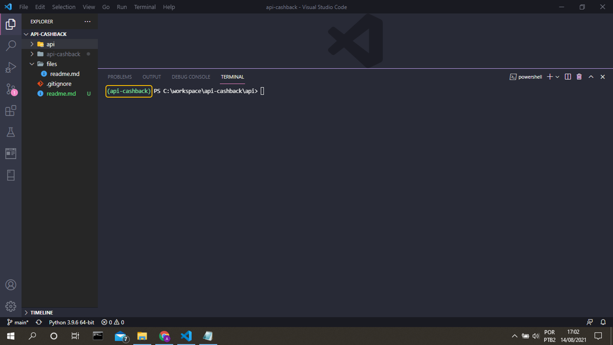

# Projeto API Cashback

## Introdução

O projeto de desenvolvimento da API (Application Programming Interface) tem como objetivo, receber dados de um sistema ERP varejista e calcular o valor de cashback para o cliente de acordo com a regra de negócio. Para mais detalhes do projeto, consulte a [proposta técnica](files/readme.md).

## Stacks Utilizadas:

Frameworks utilizado no desenvolvimento do projeto:

1. Django
2. Django Rest Framework
3. SQLite3

## Preparação do Ambiente: 

O módulo _venv_ fornece soluções para criar ambientes virtuais isolado do diretória do sistema. A principal vantagem é isolar o _venv_ do Sistema Operacional, para evitar conflitos de pacotes e bibliotecas.

### Criar um Ambiente Virtual

Os seguintes passos descreve como criar um ambiente virtual no sistema operacional Windowns. Para informações de MacOS e Unix, porfavor consulte a [Documentação](https://docs.python.org/pt-br/3/library/venv.html).

~~~cmd
mkdir API-CASHBACK

cd API-CASHBACK

python -m venv api-cashback
~~~

### Ativando o Ambiente Virtual

~~~cmd
api-cashback/Scripts/Activate
~~~

Deve aparecer a palavra (api-cashback) nas cor verde, indicando que o ambiente virtual está ativado.

### Instalação dos Pacotes e Bibliotecas:

## Referências Bibliográficas

1. [Documentação do Django](https://docs.djangoproject.com/en/3.2/)
2. [Documentação do Django Rest Framework](https://www.django-rest-framework.org/)
3. [Crie APIs REST com Python e Django REST Framework: Essencial](https://www.udemy.com/course/criando-apis-rest-com-django-rest-framework-essencial/)
4. [Guia Básico de Markdown](https://docs.pipz.com/central-de-ajuda/learning-center/guia-basico-de-markdown#open)
5. [Criação de Ambientes Virtuais](https://docs.python.org/pt-br/3/library/venv.html)